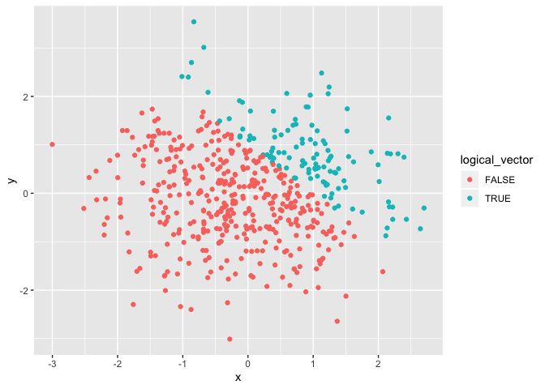
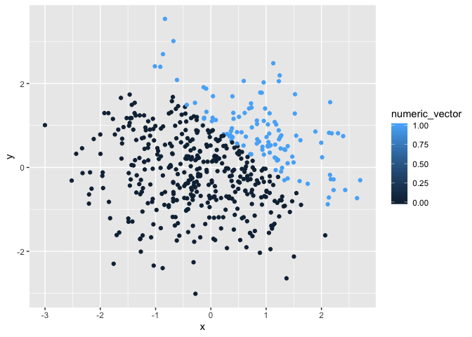

Homework 1 JL5295
================
Jana Lee
9/17/2019

**Problem
    1**

``` r
library (tidyverse)
```

    ## ── Attaching packages ────────────────────────────────────────────────────── tidyverse 1.2.1 ──

    ## ✔ ggplot2 3.2.1     ✔ purrr   0.3.2
    ## ✔ tibble  2.1.3     ✔ dplyr   0.8.3
    ## ✔ tidyr   1.0.0     ✔ stringr 1.4.0
    ## ✔ readr   1.3.1     ✔ forcats 0.4.0

    ## ── Conflicts ───────────────────────────────────────────────────────── tidyverse_conflicts() ──
    ## ✖ dplyr::filter() masks stats::filter()
    ## ✖ dplyr::lag()    masks stats::lag()

``` r
problem1_df = tibble(
  sample=rnorm(8),
  logical_vector = sample > 0,
  char_vector = c("Help", "am", "I", "doing", "this", "correctly", "ahh", "ahh"),
  factor_vector = factor(c("red", "yellow", "blue", "red", "yellow", "blue","red", "red"))
)
# Problem 1 asks us to take a deep dive into creating a dataframe. 
# problem1_df was created and allows us to explore different types of vectors.

mean_sample = mean(pull(problem1_df, sample))
  # Mean of sample is -0.2224873.

mean_logical_vector = mean(pull(problem1_df, logical_vector))
  # Mean of logical_vector is 0.5.

mean_char_vector = mean(pull(problem1_df, char_vector))
```

    ## Warning in mean.default(pull(problem1_df, char_vector)): argument is not
    ## numeric or logical: returning NA

``` r
mean_factor_vector = mean(pull(problem1_df, factor_vector))
```

    ## Warning in mean.default(pull(problem1_df, factor_vector)): argument is not
    ## numeric or logical: returning NA

``` r
  # Both the mean of char_vector and factor_vector generated a warning message. 
  # This does explain what is happening when we try to take the mean because 
  # char_vector and factor_vector are not logical or numerical vectors.
```

Second code chunk, with as.numeric
function.

``` r
# Convert the logical vector to numeric and multiply the random sample by 
# the result.
as.numeric (pull(problem1_df, logical_vector))*(pull(problem1_df, sample))

# Convert the logical vector to a factor and multiply the random sample by 
# the result.
as.factor (pull(problem1_df, logical_vector))*(pull(problem1_df, sample))

# Convert the logical vector to factor and then convert the result to nnumeric 
# and then multiply the random sample by the result.
as.numeric (as.factor (pull(problem1_df, logical_vector)))*(pull(problem1_df, sample))
```

**Problem 2**

``` r
problem2_df = tibble(
  x = rnorm (500),
  y = rnorm (500),
  logical_vector = x + y > 1,
  numeric_vector = as.numeric (logical_vector),
  factor_vector = as.factor (logical_vector),
)
```

The dataset has 500 rows and 5 columns. The mean of x is -0.0257601. The
median of x is 0.018112. The standard deviation of x is 0.975072. The
proportion of cases for which x + y \> 1 is 0.234.

Scatterplot of y
vs. x

``` r
ggplot(problem2_df, aes(x, y, color = logical_vector)) + geom_point()
```

<!-- -->

``` r
  # There are two colors for the logical_vector scatterplot, one red and one green.

ggplot(problem2_df, aes(x, y, color = numeric_vector)) + geom_point()
```

<!-- -->

``` r
  # There is a gradient of sky blue to dark blue for the numeric_vector scatterplot.

ggplot(problem2_df, aes(x, y, color = factor_vector)) + geom_point()
```

<!-- -->

``` r
  # There are two colors for the factor_vector, one red and one green.
```
